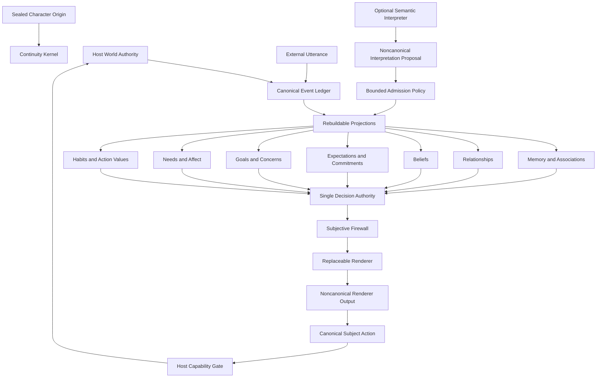

# Frankenstein

## Persistent Character Runtime

Frankenstein is a local-first, renderer-neutral runtime for building one continuing artificial character whose identity, lived history, relationships, beliefs, commitments, expectations, affective residue, goals, memories, habits, and consequences remain outside any one language model.

The project is designed around a narrow claim: a persistent character should not disappear when the model changes. A language model may help interpret language or realize speech, but it is not the database of the character, it is not the authority over objective reality, and it is not allowed to silently rewrite biography or identity.

Frankenstein is not a consciousness claim. It is an engineering system for causal character continuity.

This README is the canonical project specification, production plan, architecture contract, operating guide, developer handoff, release gate, and current status record. If code, comments, issues, or future documents disagree with this README, either the README must be deliberately updated as part of the same reviewed change or the implementation is considered out of contract.

## Current status

Version `0.1.0` is the first production baseline. The local release candidate has passed the complete deterministic test suite, the end-to-end acceptance harness, package installation, CLI smoke testing, integrity verification, replay verification, backup and restore verification, Python 3.11 syntax parsing, multi-process writer testing, and scale probes described later in this document.

The repository has a GitHub Actions matrix for Python 3.11, 3.12, and 3.13 on Windows, macOS, and Linux. That matrix is part of the release gate. The first published matrix exposed a Windows-only SQLite handle-lifetime defect that Unix runners did not reveal; the storage connection contract was corrected and a regression now verifies that context-managed database handles are actually closed. The corrected code-bearing commit `db77469ad46e7b9e0e76caf3fd5a8890dec3b110` passed all 9 matrix jobs in GitHub Actions run `37376547425`.

| Verification area | Current local result |
| --- | --- |
| Deterministic tests | 51 passed |
| End-to-end acceptance probes | 15 passed |
| Python 3.11 grammar compatibility | Passed across source and tests |
| Editable package installation | Passed |
| Wheel build and isolated target install | Passed |
| CLI init, status, chat, doctor, verify | Passed |
| Canonical ledger replay equivalence | Passed |
| Backup and restore equivalence | Passed |
| Two-process shared-home writer test | Passed |
| 5,000-event scale replay | Passed |
| Mandatory cloud service | None |
| Mandatory LLM | None |
| Mandatory vector database | None |

## Product objective

The finished product is a character runtime rather than a prompt wrapper. The durable thing is the character home. The character home contains a sealed authored origin and a canonical event history. Everything that can be derived from those records is a projection and can be rebuilt. Language models remain replaceable semantic and expressive organs.

A useful operational test is simple. If the current renderer is deleted, the character must still have a valid identity, history, relationships, beliefs, expectations, commitments, goals, affective state, memories, habits, and inspectable decision machinery. If the database projections are deleted, the event ledger must be able to reconstruct them. If an LLM invents a fact, the invention must not silently become world truth. If two copies live different lives, their state must diverge rather than pretending they are still one writable individual.

## Design doctrine

Frankenstein inherits the strongest recurring principle across the preceding research program: what happens to the character must change the character who encounters what happens next.

The project therefore prioritizes path dependence over persona theater. Memory is useful only when it can change later cognition or behavior. Affect is useful only when it can persist and bias later action. Relationships are useful only when the same event can be interpreted differently depending on who caused it and what has happened before. Commitments are useful only when they survive interruption. Model independence is useful only when changing the renderer does not silently replace the subject.

The second doctrine is authority separation. Objective facts, subjective interpretations, model proposals, beliefs, actions, and host side effects are deliberately different things. Frankenstein does not allow one natural-language response to collapse those categories.

The third doctrine is one action-selection authority. A renderer, semantic interpreter, memory retriever, relationship system, need system, habit learner, and planning layer may contribute pressure or evidence. None of them independently executes behavior. Action competition remains centralized and auditable.

The fourth doctrine is additive autobiography. Reflection and consolidation may summarize or reinterpret earlier experience, but they never delete or overwrite the source events. The system can therefore preserve later reinterpretation without pretending that the later wording is the original experience.

## Architecture at a glance



The renderer sits near the end of the pipeline. It does not sit at the center of identity.

## Authority matrix

The authority matrix is the central safety and continuity contract. A component may inspect or propose outside its authority domain, but it cannot directly author another domain without an explicit transition.

| State or claim | Canonical owner | Allowed input | Direct write rule |
| --- | --- | --- | --- |
| Authored identity origin | Character origin file | Human author or controlled build tooling | Runtime cannot rewrite it |
| Objective world event | Host | Game engine, device adapter, application host | Host only |
| Observed speech occurrence | Host | Messaging or conversation surface | Host records what was said, not whether it was true |
| Semantic interpretation | Subject admission layer | Optional model or deterministic interpreter proposal | Proposal is noncanonical until bounded admission |
| Belief | Subject belief ledger | Evidence event identifiers | Requires explicit evidence lineage |
| Relationship state | Subject relationship projection | Social events, admitted appraisals, outcomes | Only typed bounded updates |
| Expectation | Subject prospective state | Lived evidence or explicit subject formation | Typed creation and transition |
| Commitment | Subject prospective state | Explicit acceptance or subject formation | A request is not automatically a commitment |
| Goal | Subject goal system | Subject formation or governed planning | Model suggestion alone is not a goal |
| Affect | Subject causal state | Bounded appraisal and time decay | Typed bounded deltas |
| Need state | Subject causal state | Time and governed state changes | Typed bounded updates |
| Memory | Subject memory system | Canonical events and admitted subjective records | Source lineage retained |
| Private model thought | Nobody by default | Renderer or interpreter | Noncanonical until explicitly admitted |
| Decision score | Decision engine | Projected causal state | Machine state only, not first-person knowledge |
| Speech wording | Renderer proposal, then subject action | Subjective frame | Renderer output remains noncanonical; emitted speech is a canonical action |
| Tool or external side effect | Host capability layer | Approved subject action | Default deny until host registers and enables capability |

## Repository layout

```text
Frankenstein/
    README.md
    pyproject.toml
    examples/
        character.origin.json
    src/frankenstein/
        api.py
        backup.py
        capabilities.py
        cartridge.py
        cli.py
        decision.py
        doctor.py
        engine.py
        evaluation.py
        firewall.py
        lifecycle.py
        lock.py
        memory.py
        projections.py
        renderer.py
        runtime.py
        semantic.py
        storage.py
        types.py
    tests/
        ...
    .github/workflows/tests.yml
```

The `engine.py` module is the orchestration seam. It should remain thin enough that ownership is visible. Canonical persistence lives in `storage.py`. Rebuild semantics live in `projections.py`. Decision authority lives in `decision.py`. Model-facing boundaries live in `renderer.py`, `semantic.py`, and `firewall.py`. External side-effect authority lives in `capabilities.py`.

## Character home

A character home is a runtime directory created by `frankenstein init`. It contains at minimum `character.origin.json`, `state.sqlite3`, and a small advisory writer lock. SQLite may also create WAL and shared-memory sidecars while the character is running.

The character home is the portable runtime identity package. Back it up as a unit. Do not copy only the current SQLite tables while discarding the origin file. Do not edit the event ledger manually. Do not create two independently writable copies and later pretend that both are still one uninterrupted person.

The origin file is sealed by content digest when the home is initialized. Opening the same home with a different origin fails. Runtime development belongs in lived state, not by mutating the historical origin in place.

## Character origin format

The authored origin is intentionally compact. It contains stable identity material and starting dispositions, not the entire future personality.

```json
{
  "entity_id": "example-character-v1",
  "display_name": "Mara",
  "version": 1,
  "description": "A persistent example character.",
  "traits": {
    "curiosity": 0.55,
    "caution": 0.20
  },
  "values": {
    "honesty": 0.80,
    "autonomy": 0.85
  },
  "voice": [
    "Use direct, natural sentences.",
    "Do not invent memories."
  ],
  "baseline_needs": {
    "energy": 0.70,
    "safety": 0.70,
    "affiliation": 0.50,
    "competence": 0.50,
    "curiosity": 0.50
  },
  "relationship_defaults": {
    "trust": 0.0,
    "familiarity": 0.0,
    "attachment": 0.0,
    "respect": 0.0,
    "obligation": 0.0,
    "resentment": 0.0,
    "fear": 0.0
  },
  "action_priors": {
    "engage": 0.03
  },
  "metadata": {}
}
```

Values are intentionally bounded. The origin format is versioned. A future format change must ship with an explicit migration rather than silently interpreting old data under new semantics.

## Canonical event ledger

SQLite contains an append-only event table. Every event has a sequence number, event identifier, timestamp, kind, authority, canonicality, actor scope, JSON payload, causal parent identifiers, previous hash, and event hash.

The hash chain detects accidental or unauthorized mutation after the fact. It is an integrity mechanism, not a cryptographic signature and not a defense against a fully hostile process that can rewrite both data and hashes. If hostile remote custody becomes a real deployment requirement, signatures or authenticated checkpoints can be added as a separate security profile.

Canonical events are fail-closed by kind and authority. A renderer cannot write a canonical belief event. Unknown causal parents are rejected. Integrity verification rejects parent references that point forward in time. Future unknown database schema versions fail closed.

The event ledger is authoritative history. Projection tables are optimized views.

## Projection model

Needs, affect, relationships, beliefs, commitments, expectations, goals, concerns, habits, memories, associations, and current runtime state are projections of the canonical history plus the sealed origin.

A projection cursor records the latest event sequence incorporated into projections. Each character mutation acquires a cross-platform advisory writer lock, verifies that projections are current, commits the event, advances the projections, then releases the lock. If a process crashes after the event is committed but before projection advancement, reopening the home detects the cursor mismatch and performs a deterministic rebuild.

The rebuild path clears disposable projection tables, seeds origin state, replays canonical events in sequence, reconstructs memory terms and associations, and advances the projection cursor to the end of the ledger.

Replay equivalence is a release requirement. The causal projection digest before a rebuild must equal the digest after rebuild.

## World authority, perception, interpretation, and belief

Frankenstein deliberately separates four concepts that are often collapsed in agent systems.

A world event means the host asserts that something happened in the external environment. A social observation means the host asserts that a specific actor emitted specific text. Neither event means that every proposition inside the observation is true.

An interpretation is the character's reading of an observation. A language model may propose that reading, but the proposal is noncanonical. The admission policy sanitizes tags, rejects unknown relationship dimensions, clamps relationship change, limits proposal size, and records a separate canonical subject interpretation if admitted.

A belief is stronger still. Beliefs require explicit evidence event identifiers. Semantic-interpreter claim proposals never become beliefs automatically. This prevents a model from turning its own paraphrase into canonical knowledge by repetition.

## Memory

Memory is event-backed and provenance-preserving. Current memory rows contain a memory identifier, memory type, actor scope, text, tags, salience, valence, arousal, creation time, source event identifier, and noncausal access telemetry.

Retrieval combines lexical overlap, salience, recency, actor relevance, and bounded associative spreading. Maximal marginal relevance reduces near-duplicate results. The associative graph is intentionally degree-bounded so a recurring common tag cannot create unbounded quadratic growth.

A deterministic term index avoids scanning every memory on each recall. The term index is disposable and is rebuilt from canonical memory events. Retrieval access count and last-access time are diagnostic metadata only. They currently do not affect action selection and are therefore excluded from the causal projection digest. If a future version makes retrieval history behaviorally causal, retrieval events must first become canonical or otherwise replayable.

Embeddings are not required. A future embedding adapter can be added behind the memory interface without making a vector database canonical state.

## Long-horizon memory and consolidation

Frankenstein adopts the strongest idea from Anima's long-horizon lifecycle while tightening its provenance boundary. Reflection and period consolidation create new subjective memories linked to source events. They never replace original events.

The lifecycle layer can record immediate afterglow reflection, daily summaries, weekly summaries, monthly summaries, quarterly summaries, yearly summaries, and eventual life summaries. Coarse summaries can be loaded into the subjective frame together with recent detailed memory. This provides bounded context over long lives without allowing summarization to erase history.

A summary is the subject's later account of earlier material. It is not a rewrite of the earlier material.

## Needs and homeostasis

The baseline origin carries needs such as energy, safety, affiliation, competence, and curiosity. The host advances wall-clock or simulation time explicitly through `advance_time`. Time is therefore not fabricated by a renderer.

Time changes needs through bounded rates. Long elapsed jumps are capped per call to seven days so a clock error cannot silently create an arbitrarily large developmental discontinuity. A host that needs to process a larger absence can do so in deliberate bounded segments and inspect each result.

Need pressure can contribute directly to decision scores. Low energy can therefore increase the utility of rest without requiring a prompt to say the character is tired.

## Affect

Current affect contains valence, arousal, and tension. Affect is not cosmetic response styling. Bounded affect values can influence later decision scores.

World events may carry appraisal hints that are converted into bounded affect updates. Expectations that are violated can create negative residue and tension. Elapsed time moves affect toward baseline rather than resetting it instantly.

The renderer does not receive raw affect numbers. The subjective firewall translates causal state into qualitative first-person-accessible descriptions such as active tension or elevated activation.

## Relationships

Relationships are actor-specific and multidimensional. The default dimensions are trust, familiarity, attachment, respect, obligation, resentment, and fear. Dimensions move independently.

This avoids the single reputation-meter problem. A character can trust someone while resenting them, care about someone while fearing them, or respect someone without feeling attached.

Relationship updates are typed and bounded by the origin schema. Unknown dimensions are rejected. Optional semantic interpreters cannot invent new dimensions. The same decision candidate can therefore score differently for two actors or for the same actor after different histories.

## Expectations

Expectations represent predictions about future social or world behavior. They are distinct from commitments. An expectation records what the character anticipates, not what the character has promised to do.

Expectations can be open, confirmed, violated, or cancelled. The current reference policy makes confirmation modestly reinforce trust and makes violation reduce trust, increase resentment, and leave negative affective residue. The exact coefficients are intentionally small and centralized so they can be evaluated rather than proliferating as unexplained personality constants.

## Commitments

Commitments persist independently of the current conversation. A commitment has its own identifier, description, optional related actor, optional due time, status, and source event.

A request from another actor is not automatically a commitment. The subject must create one through the commitment path. Commitments can later be fulfilled, broken, or cancelled.

## Goals and concerns

Goals have persistent identity, priority, status, and optional parent linkage. They survive restart because they are canonical events and projections rather than prompt text.

Concerns are persistent unresolved pressures with explicit intensity and status. They can bias candidate actions through keyword-scoped concern relevance. Concerns are not automatically deleted when a conversation ends.

The current goal system is deliberately modest. Frankenstein does not yet ship an unrestricted autonomous planner. A future planner must produce proposals into the same action authority rather than becoming a second competing executor.

## Habit and action-value learning

Action outcomes can carry bounded reward. The habit projection updates a slowly moving action value. Future decision scores may use that action value.

This gives experience a causal path into later choice without requiring online neural training. It is intentionally simple and replayable. More complex recurrent or reinforcement-learning policy modules may be added later only behind the same decision interface and only if controlled ablations show additional value.

## Single decision authority

`DecisionEngine` is the single action competition point in the current runtime.

An action candidate contains a base utility plus optional weights for relationship dimensions, needs, affect axes, goal keywords, concern keywords, learned habit value, and host capability requirements. The decision engine produces a receipt containing every candidate score, the selected action, and inspectable contribution reasons.

Decision receipts are canonical machine audit records. Their raw numbers are not exposed to the subjective frame.

The system currently uses deterministic argmax with bounded inertia and changing internal state. This maximizes replayability for the production baseline. Controlled stochastic or recurrent policy plugins may be added later, but any randomness must be seeded and replayable if it affects canonical development.

## Semantic interpretation

Semantic interpretation is optional. A deterministic interpreter is included for small bounded social cues. An Ollama semantic interpreter can provide richer interpretation while remaining outside authority.

The interpreter returns a structured proposal containing a short subjective summary, tags, relationship deltas, and claim proposals. The proposal is stored as noncanonical evidence. The admission policy then sanitizes and bounds what may influence the subject.

Relationship deltas are restricted to the character's declared dimensions and clamped per interaction. Claim proposals remain proposals and do not become beliefs. Admitted interpretation summaries may become explicitly labeled interpretation memories with full causal lineage.

This is how Frankenstein uses an LLM as a cognitive organ without treating model output as autobiography or objective truth.

## Subjective firewall

The renderer receives a `SubjectiveFrame`, not the raw database.

The frame currently includes the present situation, qualitative relationship state, qualitative bodily pressure, qualitative affect, open commitments, active goals, retrieved memories, recent dialogue, long-horizon summaries, active concerns, the selected social move, and voice constraints.

The frame does not contain event hashes, source event identifiers, projection cursors, checkpoint hashes, decision scores, utility scores, or other machine-native implementation details.

The rule is simple: the machinery may use numbers that the subject does not automatically know.

## Renderer

The renderer owns wording, not character state.

A deterministic renderer is included so the entire runtime can operate and be tested without any LLM. `OllamaRenderer` supports a local Ollama model. `OpenAICompatibleRenderer` supports any compatible endpoint through an explicit URL and environment-based key.

Renderer output is always stored as a noncanonical `renderer_output` event first. If the runtime actually emits the response as the character's speech, a separate canonical `subject_action` records that the character said those words. This preserves the difference between generated candidate prose and lived action.

Changing renderer may change language quality. It must not directly rewrite needs, relationships, beliefs, commitments, goals, memory, or world state.

## Capability gate

Wanting to do something and having permission to do it are separate.

External capabilities are registered by the host. They are disabled by default. The character may select or propose an action that requires a capability, but execution fails unless the host both registered and enabled that capability.

This is the boundary for email, file writes, messaging, game-engine actions, device control, network requests, purchases, or any other side effect. Model text never constitutes permission.

## Autonomous heartbeat

A heartbeat is a bounded autonomous decision opportunity. It uses the same decision engine as ordinary action selection. The default reference candidates include rest, reviewing commitments, pursuing a goal, and reflection.

The heartbeat does not create a second hidden agent. It selects through the same causal state and records the resulting autonomous subject action.

`HeartbeatRunner` can execute a finite number of cycles or run on a configured interval. Production process supervision should be provided by the operating system, container runtime, service manager, or host application rather than reinvented inside the cognitive core.

## Durability and concurrency

SQLite uses WAL mode and `synchronous=FULL`. Mutations are serialized by a cross-platform advisory writer lock around the event-plus-projection sequence.

This is designed for multiple local processes that cooperate over one character home. It is not a distributed lock for multiple machines writing a network share.

If one process crashes after event commit but before projection completion, the projection cursor detects the incomplete transition and rebuilds from the ledger on next open.

Two independently writable copies of a character home are not automatically mergeable. Once their lived events differ, they are branches or descendants sharing a common past. Silent psychological-history merge is intentionally unsupported.

## Integrity and backup

`frankenstein verify HOME` recomputes the complete event hash chain and validates causal parent ordering.

`frankenstein doctor HOME` checks the event ledger, sealed origin digest, projection cursor, and SQLite quick check.

`frankenstein backup HOME FILE.tgz` uses SQLite's backup API, copies the sealed origin, records a manifest, and packages the minimum portable state.

`frankenstein restore FILE.tgz NEW_HOME` validates the archive member set, rejects unsafe archive members, verifies the origin digest, verifies the event ledger, refuses to overwrite an occupied destination, restores state, and rebuilds projections.

The backup archive is integrity-checked but is not encrypted. Encryption belongs at the filesystem, archive, or deployment layer depending on threat model.

## HTTP API

The built-in HTTP service is intentionally small and dependency-free. Loopback binding can run without a token. Binding to any non-loopback address requires a bearer token at construction time.

The current endpoints are shown below.

| Method | Path | Purpose |
| --- | --- | --- |
| GET | `/health` | Process liveness |
| GET | `/status` | Character and persistence status |
| POST | `/chat` | Submit one actor utterance and receive character speech |
| POST | `/event` | Submit a structured host world event |
| POST | `/outcome` | Submit an action outcome and reward |
| POST | `/verify` | Run event-ledger verification |

Request bodies are limited to 1 MB. Error responses do not expose exception traces. CORS is not enabled by default.

## Installation

Python 3.11 or later is required.

```bash
python -m venv .venv
```

On Windows:

```powershell
.venv\Scripts\Activate.ps1
python -m pip install -e .
```

On macOS or Linux:

```bash
source .venv/bin/activate
python -m pip install -e .
```

No runtime dependency beyond the Python standard library is required for the baseline engine.

## First character

Copy the example origin and edit it before initialization.

```bash
cp examples/character.origin.json my-character.origin.json
frankenstein init ./mara-home --origin my-character.origin.json
frankenstein status ./mara-home
```

On Windows, ordinary `copy` or File Explorer can be used instead of `cp`.

After initialization, treat the origin in the home as sealed historical material. Do not edit it to simulate development.

## Deterministic chat

The runtime works without a model.

```bash
frankenstein chat ./mara-home jay "Hello. Do you remember the workshop?"
```

The deterministic renderer is intentionally plain. Its purpose is to keep cognitive and persistence tests independent of model availability.

## Interactive shell

```bash
frankenstein shell ./mara-home jay
```

Inside the shell, `/status` prints the current runtime status and `/quit` exits.

## Ollama expression

Install and run Ollama separately, then choose any model available in the local Ollama installation.

```bash
frankenstein shell ./mara-home jay --ollama-model your-model-name
```

The renderer receives only the subjective frame and current message.

## Ollama semantic interpretation

Expression and semantic interpretation are separate roles. They may use the same model or different models.

```bash
frankenstein shell ./mara-home jay \
  --ollama-model your-expression-model \
  --semantic-model your-semantic-model
```

The semantic model cannot directly create beliefs, commitments, goals, capabilities, or world facts.

For a no-model semantic baseline:

```bash
frankenstein shell ./mara-home jay --deterministic-semantic
```

## Host observations

```bash
frankenstein observe ./mara-home "The workshop door opens." --actor jay --tag workshop --tag door
```

For richer host integration, use the Python API or HTTP `/event` endpoint so salience, affective appraisal hints, metadata, and causal relationships can be supplied structurally.

## Time and heartbeat

Host code can call `engine.advance_time(minutes)` to move the organism through bounded elapsed time.

A finite autonomous heartbeat run is available from the CLI:

```bash
frankenstein heartbeat ./mara-home --cycles 3 --interval-seconds 1800
```

For always-on deployment, use a real supervisor such as systemd, launchd, Windows Task Scheduler, a container orchestrator, or the embedding application's process manager.

## Local HTTP service

Loopback-only service:

```bash
frankenstein serve ./mara-home --host 127.0.0.1 --port 8765
```

Remote binding requires a token in the configured environment variable:

```bash
export FRANKENSTEIN_SERVER_TOKEN="replace-with-a-secret"
frankenstein serve ./mara-home --host 0.0.0.0 --port 8765
```

On PowerShell:

```powershell
$env:FRANKENSTEIN_SERVER_TOKEN = "replace-with-a-secret"
frankenstein serve ./mara-home --host 0.0.0.0 --port 8765
```

TLS is not implemented in the built-in server. If traffic leaves the local machine, terminate TLS in a trusted reverse proxy or tunnel and keep the bearer token secret.

## Python embedding API

```python
from frankenstein import CharacterOrigin, FrankensteinEngine
from frankenstein.types import WorldEvent

origin = CharacterOrigin(
    entity_id="mara-v1",
    display_name="Mara",
    values={"honesty": 0.8, "autonomy": 0.9},
)

engine = FrankensteinEngine("./mara-home", origin)
engine.observe(WorldEvent("Jay enters the workshop.", actor_id="jay", tags=("arrival", "workshop")))
reply = engine.chat("jay", "Good morning.")
print(reply)
```

## Game and simulation integration

The recommended game integration keeps the game engine authoritative over objective space, physics, object existence, legal actions, and action outcomes.

The game sends bounded observations to Frankenstein. Frankenstein updates subjective state and selects a structured action. The capability or action adapter validates that the action is legal in the current game state. The game executes it and sends the objective outcome back.

```text
GAME WORLD
   -> authoritative observation
FRANKENSTEIN
   -> subjective appraisal
   -> memory and social state
   -> decision receipt
   -> structured action proposal
HOST CAPABILITY GATE
   -> validation
GAME WORLD
   -> objective outcome
FRANKENSTEIN
   -> learning and continuity update
```

Do not let renderer prose directly move a game object. Do not let a game UI directly mutate trust or belief values. Both operations should cross typed boundaries.

## Testing

Run the deterministic suite:

```bash
pytest -q
```

Run the production acceptance harness:

```bash
frankenstein eval
```

Run integrity checks on a real home:

```bash
frankenstein doctor ./mara-home
frankenstein verify ./mara-home
```

The acceptance harness currently verifies ledger integrity, renderer authority denial, private-thought admission, evidence-backed belief, prospective state, matched-state path dependence, subjective firewall behavior, replay equivalence, restart continuity, backup and restore, capability denial, learning from outcomes, memory retrieval, renderer separation, and divergence after cloned histories receive different experiences.

The deterministic suite additionally covers semantic-admission clamping, malicious interpreter containment, affective residue, expectation violation, API authentication, archive safety, origin sealing, schema fail-closed behavior, recent-dialogue bounds, long-horizon summaries, two-process writer safety, and other local invariants.

## Performance reference

These numbers are engineering reference points from the local pre-publication environment using Python 3.13.5 and the standard-library runtime. They are not universal performance guarantees.

| Scenario | Result |
| --- | --- |
| 1,000 canonical events, 500 memories | 2.50 s ingest |
| 1,000-event memory retrieval median | 8.7 ms |
| 1,000-event memory retrieval p95 | 18.3 ms |
| 1,000-event full replay | 0.24 s |
| 1,000-event database after WAL checkpoint | about 4.3 MB |
| 5,000 canonical events, 2,500 memories | 11.97 s ingest |
| 5,000-event memory retrieval median | 14.8 ms |
| 5,000-event memory retrieval p95 | 21.7 ms |
| 5,000-event full replay | 0.99 s |
| 5,000-event database after WAL checkpoint | about 12.5 MB |
| 5,000-event replay digest equivalence | Passed |

The memory graph is degree-bounded. Retrieval uses a deterministic term index plus recent and actor-specific candidates, then bounded associative expansion. It does not scan every graph edge on each query.

## Security model

Frankenstein's baseline threat model assumes the local operating-system account and Python process are trusted. It protects against accidental corruption, confused authority, malformed model output, unsafe archive members, unintended remote API exposure, incompatible schema versions, and duplicate local writers.

It does not claim to protect a character home against a malicious process with arbitrary filesystem write access. The event hash chain is not a signature. The built-in HTTP server does not provide TLS. Backups are not encrypted. External capabilities are only as safe as the host handlers registered behind the capability gate.

Do not pass secrets inside character memories or prompt-visible origin fields. Use environment variables or an external secret manager for provider credentials. The example OpenAI-compatible adapter reads a configured environment variable and does not persist the key.

## Privacy model

The baseline runtime is fully local. No network call occurs unless a networked renderer, semantic interpreter, host capability, or remote API binding is explicitly configured.

The deterministic renderer and deterministic semantic interpreter require no network. Ollama defaults to loopback. Character state remains in the character home.

## Developer contract

Behavior-changing work begins by identifying which authority domain owns the proposed state. If ownership cannot be named, the feature is not ready to implement.

A new causal state family requires a canonical event representation or a deterministic derivation from existing canonical events. It requires a projection table or documented derivation, replay support, inclusion in the causal digest if it can affect later behavior, a subjective-firewall policy if the subject may perceive it, decision integration if it is supposed to matter, and tests showing that changing the state changes an observable downstream result.

A new model-facing feature must begin as a proposal unless the model is performing wording only. Model-generated claims cannot be promoted to world truth. If a model-generated subjective interpretation is admitted, the admission must preserve lineage to the proposal and the source observation.

A new host side effect requires a capability name and host registration. It must not be smuggled through the renderer or semantic interpreter.

A new cache or search index should remain disposable. If deleting it destroys unique history, it is not a cache.

## Adding an event kind

The change is incomplete until the event enum, canonical authority rule, projection behavior if any, replay behavior, integrity tests, and README authority semantics agree.

If the event is noncanonical only, do not add it to canonical authority rules. If a canonical event can alter later decisions, ensure the effect is represented in the causal projection digest.

## Adding a projection

Projection tables are not independent truth stores. The projector must be able to recreate each row from the sealed origin and canonical events.

The required development test is to create a representative history, record the projection digest, delete and rebuild projections, then confirm the digest is identical.

## Adding a renderer

A renderer implements the `Renderer` protocol and returns `RenderedResponse`. It receives a `SubjectiveFrame` and current text. It does not receive a mutable database handle.

The renderer must not be allowed to select canonical actions by bypassing `DecisionEngine`. A renderer may realize a selected move in language. If a future system wants model-generated action candidates, those candidates must enter as proposals and compete through the decision authority.

## Adding a semantic interpreter

A semantic interpreter implements the `SemanticInterpreter` protocol and returns `InterpretationProposal`.

The admission policy is deliberately separate from the interpreter. Do not let a provider-specific adapter write relationship state or beliefs directly. The policy is the stable contract and provider adapters are replaceable.

## Adding a planner

A planner is not currently part of the minimum core. If added, it must create goals, subgoals, routes, or action candidates through typed interfaces. It must not execute actions directly. Plan state that survives restart must be canonical or replayably derived.

A planner earns inclusion only after tests show better prospective behavior than the simpler goal and commitment substrate without breaking renderer neutrality or replay.

## Adding recurrent or neural policy state

The earlier research program contains recurrent-policy and plasticity experiments. Frankenstein does not hardwire them into version 0.1 because production architecture should not pay for mechanisms that have not earned their cost in the integrated runtime.

A future recurrent policy module should live behind an explicit policy interface. Its checkpoint, random seed, training update, and outcome reinforcement must be replayable or versioned. It should be compared against the deterministic selector in matched-history ablations before becoming a default dependency.

## Database migration policy

Database schema version `1` is explicit. A future runtime that needs schema `2` must ship a migration command or automatic transactional migration with a tested backup path.

Opening an unknown schema version currently fails closed. Silent best-effort interpretation of future state is forbidden.

The event ontology also requires version discipline. A change that reinterprets the historical meaning of an existing event kind is a migration, not a refactor.

## Branching and identity

Copying a character home creates a new writable branch at the moment the copies begin receiving different events.

Frankenstein deliberately does not implement automatic branch merge. Combining two lived histories raises unresolved semantic questions about mutually exclusive events, duplicated experience, incompatible relationship trajectories, and self-location. Those questions require an explicit merge theory before code is added.

Backup restore is continuation when one branch remains authoritative. Running two restored copies independently creates descendants.

## Failure recovery

If the process stops unexpectedly, run `frankenstein doctor HOME`. If the event ledger is valid but the projection cursor is behind the ledger, reopening or rebuilding recovers projections from canonical events.

If the event ledger fails hash verification, do not continue writing to the same home until the cause is understood. Restore from a verified backup or perform a deliberate forensic repair that preserves the damaged copy.

If the origin digest does not match, do not replace the origin to make the error disappear. Determine whether the wrong home, wrong origin, or an unauthorized edit caused the mismatch.

## Donor architecture review

Frankenstein is a synthesis, but it is not a source-code collage. The implementation was written as a clean production core after reviewing prior internal work, Anima, and current external agent frameworks. No external donor is allowed to become identity authority merely because it has a mature memory or workflow layer.

| Donor or lineage | Strong contribution retained | What Frankenstein deliberately changes |
| --- | --- | --- |
| Anima | Local-first operation, swappable local model, afterglow, nightly consolidation, fractal long-horizon memory, operational ergonomics | Summaries are explicitly source-linked subjective records; prose memory is not the only causal substrate |
| DUCK | Living-subject authority, needs, motivation, prospective agency, subjective firewall, path-dependence testing | Production baseline uses a smaller deterministic selector and typed state before adding more experimental cognition |
| Wayfarer | Renderer neutrality, world authority, one canonical lived history, authority matrix, sparse execution doctrine | Concepts are rebuilt into a smaller dependency-free runtime rather than importing the older engine |
| Pretorius V6 lineage | Actor-specific memory, multidimensional relationships, open loops, self-accounting, selective recall | Current implementation keeps a reduced relation set and bounded graph until additional dimensions prove useful |
| Digital Subject / Persona and Jelly Sandwich | Persistent organism, offscreen time, expectations, commitments, relationship continuity, world-consequence separation | These are integrated behind the same event and replay substrate |
| The Doctor Lives | Causal audit mentality, provenance, renderer-neutral subject, inspectable policy effects | Recurrent policy remains optional future work rather than default production complexity |
| Kiki Mind | Canonical history versus disposable projections, evidence context, refusal to turn reconstruction into autobiography | Frankenstein applies that doctrine to all core projection tables |
| TinyPersonaEngine | World fact to perception to subjective experience boundary, action validation | The firewall and host gate use the same separation in a general character runtime |
| Bicentennial Man | Matched histories, ablation thinking, held-out evaluation | Acceptance includes same-origin divergence and matched-history path-dependence gates |
| Kurzweil Brain Experiments | Developmental counterfactuals and leakage discipline | Production character runtime keeps developmental state generic and does not embed subject-specific answer keys |
| Letta | Mature stateful-agent ergonomics and persistent identity across sessions and models | Frankenstein does not let a memory-first agent harness define character truth |
| Graphiti | Temporal provenance and evolving context graphs | Frankenstein keeps a bounded local association graph and SQLite ledger as the canonical source |
| LangGraph | Durable workflow thinking, resumability, idempotent side-effect boundaries | Core runtime does not require a workflow framework |
| Pydantic AI | Typed boundaries and separation of durability from chat persistence | Core remains standard-library only; typed adapters can be added without ownership changes |
| Concordia | Explicit environment or game-master authority over action outcomes | Host world authority is a first-class contract and is separate from subjective interpretation |
| FAtiMA | Appraisal as a causal behavior variable rather than cosmetic emotion | Version 0.1 uses compact affect axes and typed appraisal rather than importing the full toolkit |

## Why Frankenstein is not Anima with more tables

Anima demonstrates an unusually coherent persistent local companion environment. Its strongest product lesson is that lifetime continuity needs operational machinery around the model, including wake cycles, reflection, context management, local tools, and memory condensation.

Frankenstein differs at the causal core. A memory summary, identity page, or model-written journal is not sufficient authority by itself. The runtime distinguishes observation from interpretation, interpretation from belief, belief from world truth, renderer proposal from subject action, desire from permission, and raw machine state from subjective access.

That distinction is the main reason this repository exists rather than simply forking Anima.

## Why Frankenstein does not adopt one external framework wholesale

Letta, LangGraph, Pydantic AI, Graphiti, Concordia, and FAtiMA solve real production problems. They are valuable integration candidates, not identity kernels.

A workflow engine can make a run durable without defining who the character is. A temporal graph can improve memory without deciding what counts as lived autobiography. A social simulation environment can own world consequences without owning subjective belief. A model SDK can provide typed tool calling without being the continuity ledger.

Frankenstein preserves those separations so external frameworks can be swapped later.

## Production roadmap

Version 0.1 establishes the minimum complete continuity kernel. The next production phase should not add mechanisms indiscriminately. Each addition must answer an observed failure and survive an ablation.

The first priority is longitudinal evaluation over thousands of interactions with multiple renderer sizes. The system should measure same-character recognizability, behavioral path dependence, relationship hysteresis, prospective-memory success, commitment resumption, repetition, retrieval quality, replay stability, database growth, and latency.

The second priority is a structured planning extension. It should add persistent routes and subgoals without creating a second action executor. Failed outcomes should change later route selection. The deterministic goal and commitment baseline should remain as the comparison condition.

The third priority is richer social cognition. Candidate additions include explicit relationship expectations, social roles, theory-of-mind hypotheses, group context, and norms. These should remain actor-scoped and provenance-preserving.

The fourth priority is controlled recurrent policy experimentation. The strongest recurrent work from earlier projects can be transplanted behind a policy port and evaluated against the current deterministic selector. It should be removed again if it does not improve held-out longitudinal behavior.

The fifth priority is richer embodiment adapters. Game engines, sensors, voice, avatar control, and device surfaces should integrate through host observations, action registries, and capability gates rather than writing directly into cognition.

The sixth priority is production observability. Structured metrics should track event throughput, projection lag, replay time, memory retrieval latency, context size, model failures, capability denials, and renderer swaps without logging private content by default.

The seventh priority is explicit migration tooling once schema version 2 is needed. Version 1 should remain readable and testable as a preserved baseline.

## Release acceptance contract

A Frankenstein release is not accepted because the code compiles or the character sounds convincing in one chat.

The deterministic suite must be green. The end-to-end acceptance harness must be green. Event replay must reproduce the causal projection digest. A renderer must be unable to write canonical beliefs. A model-generated private thought must remain noncanonical until admitted. Different lived histories must produce different decisions under a matched current situation. A renderer swap must not independently select a different canonical action. Backup and restore must preserve the event ledger and causal projection digest. Multi-process local writers must not corrupt the ledger. Unknown schema versions must fail closed. The subjective frame must exclude machine-only score and event metadata. External capabilities must remain default-deny. Scale probes must remain within documented practical bounds or any regression must be explicitly accepted and explained.

Cross-platform CI on supported Python versions must be green before tagging a final release.

## Known limitations

Version 0.1 is deliberately conservative. It does not contain a general autonomous planner, a full theory-of-mind model, a social-norm engine, a distributed multi-host synchronization protocol, automatic divergent-history merge, mandatory embeddings, a vector database, biometric embodiment, a speech stack, or a recurrent neural policy.

The built-in deterministic social moves are a baseline, not a claim of human social cognition. The affect model is compact. The current memory retriever is designed for local personal-scale histories and has not yet been benchmarked at millions of memories. The built-in HTTP server is an integration surface, not an internet-facing application server.

These limitations are explicit so future work solves measured problems rather than hiding them behind larger prompts.

## License status

No project license is selected in this baseline. Until the repository owner adds a license, normal copyright applies and no broad redistribution license is granted. A license should be chosen deliberately because Frankenstein incorporates architectural ideas from multiple research and open-source projects but does not vendor their code.

## Definition of done for version 0.1

Version 0.1 is done when the local suite and acceptance harness are green, the package installs, the CLI smoke path works, replay and restore equivalence hold, the repository contains this canonical architecture contract, the cross-platform CI matrix is green, and no known critical authority or data-loss defect remains open.

Future versions must preserve the same standard. More psychological vocabulary, a larger model, or more stored memory is not progress unless the new mechanism changes relevant behavior for an inspectable reason and survives integration testing.